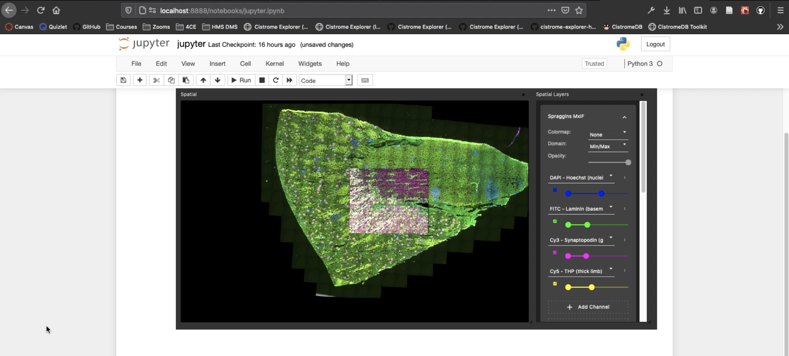

Getting Started
################

The ``vitessce`` Python package has two main parts:

* `Widget API <widget_api.html>`_: use Vitessce directly from with Jupyter Notebook or Jupyter Lab
* `Config API <config_api.html>`_: create and edit Vitessce view configs using Python syntax

Installation
-------------

To use Vitessce within a Jupyter notebook you need to install a few packages
and enable the Jupyter extension:

.. code-block:: bash
    :emphasize-lines: 1

    pip install vitessce
    jupyter nbextension enable --py --sys-prefix vitessce

To use the widget in `JupyterLab <https://jupyterlab.readthedocs.io/en/stable/>`_ also run the following:

.. code-block:: bash

    jupyter labextension install @jupyter-widgets/jupyterlab-manager
    jupyter labextension install vitessce-jupyter

Optional Dependencies
---------------------

The following dependencies are optional, and 

* ``anndata`` - Required for AnnData support with the ``AnnDataWrapper`` class.
* ``dask`` - Required for SnapTools support with the ``SnapToolsWrapper`` class.
* ``loompy`` - Required for Loom support with the ``LoomWrapper`` class.

Simplest Widget Use Case
------------------------

The simplest way to instantiate a Vitessce widget is to create a view config based on a single-cell dataset object (from which data types and visualization types can be inferred automatically) and pass the view config instance as a parameter to the widget constructor:

.. code-block:: python

  from vitessce import VitessceConfig, VitessceWidget

  vc = VitessceConfig.from_object(my_adata)
  vw = VitessceWidget(vc)
  vw

To customize the view config passed into the widget (or to define a view config manually), please see the documentation for the ``VitessceConfig`` API.

Full AnnData Example
--------------------

Download an AnnData ``.h5ad`` file:

.. code-block:: bash

  mkdir -p data
  curl -L -o data/habib17.processed.h5ad https://covid19.cog.sanger.ac.uk/habib17.processed.h5ad

Then open Jupyter Lab:

.. code-block:: bash
  
  jupyter lab

And copy the Python code from the `Embedding Notebook Demo <https://github.com/vitessce/vitessce-jupyter/blob/master/notebooks/widget-embedding.ipynb>`_.